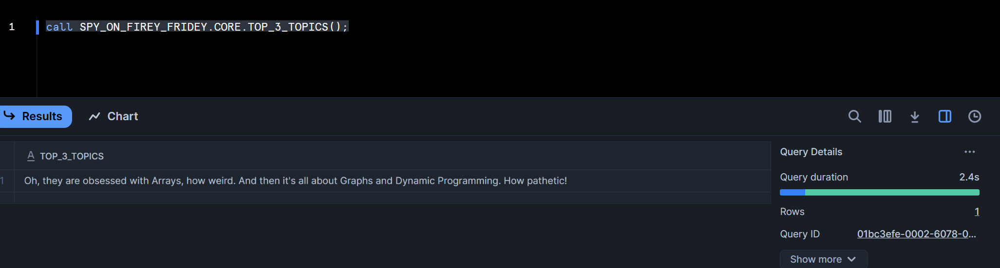
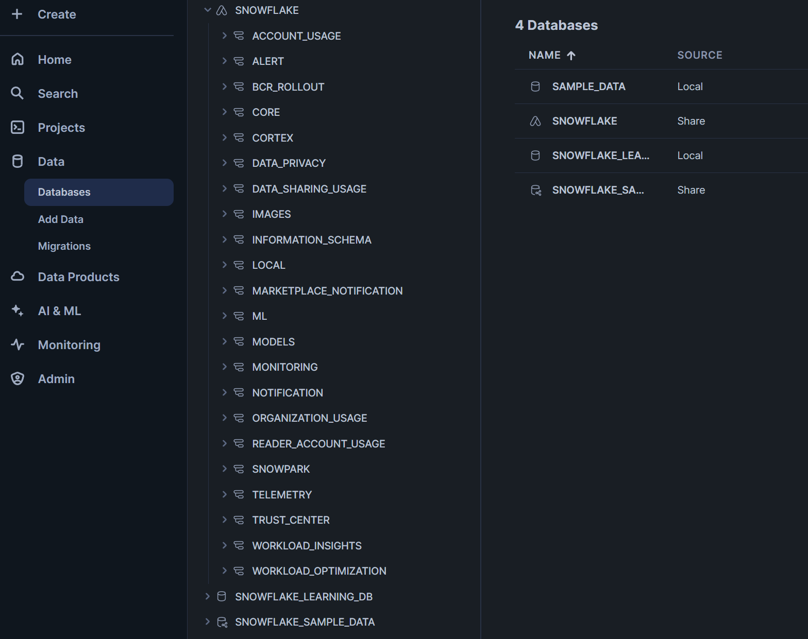
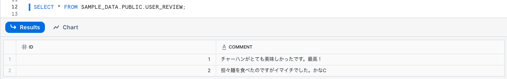
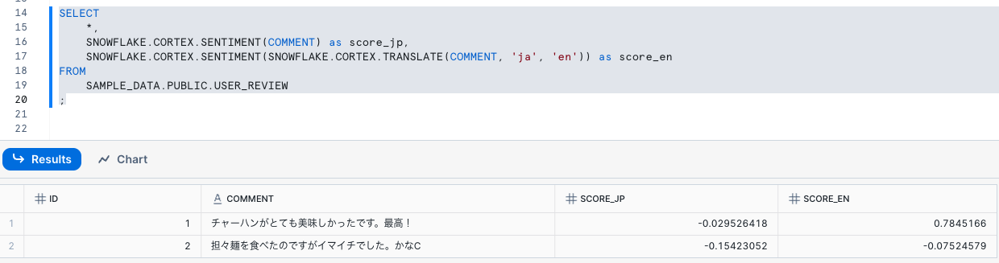

# 回答

1. Projects -> App Packages から SPY_ON_FIREY_FRIDEY というアプリを作成する
2. Data -> Databases から　SPY_ON_FIREY_FRIDEY を選択し、COREというSchemaを作成する
3. COREの中にCreateからProcedureを作成する

```sql
create procedure TOP_3_TOPICS (
    )
returns string
language python
runtime_version = '3.11'
packages = ('snowflake-snowpark-python')
handler = 'main'
as 
$$
def main():
    message = "Oh, they are obsessed with Arrays, how weird. And then it's all about Graphs and Dynamic Programming. How pathetic!"
    return message
$$
;
```

4. ワークシートでSELECTする
```sql
call SPY_ON_FIREY_FRIDEY.CORE.TOP_3_TOPICS();
```


# Snowflake Native App 小咄

Snowflake Native Appのことを遠い世界の話だと思っている人が多いですが、実はそんなことはありません。

Snowflakeユーザーはみんな気づかないうちに実はSnowflake Native Appを使っているのです。そのアプリの名前はSNOWFLAKE。

実はACCOUNT_USAGEやCORTEXはNative Appなんですね。



そう、SNOWFLAKEっていう名前のNative AppがデフォルトでインストールされているのがSnowflakeというサービスなんですね（紛らわしい）。我々は知らない間にNative Appに依存してたというわけです。

# Snowflake Native App の真骨頂
Snowflake Native AppはStreamlitアプリを共有できることがすごいのだと思っている方が多いと思うのですが、実はCLIの部分を共有できることがすごいのだというのが個人的な見解です。

CLIで使えるということは自動化できるということです。自動化のプロセスの中に差し込む関数やら何やらを共有できるということです。

Pythonなどのプログラミング言語でパッケージを公開している状況と近いですね。それをSQLでできるというのことは、dbtなどのプロセスに無理なく差し込めるということです。

これがSnowflake Native Appの真の凄さだと思います。

# 実演 Cortex
dbtの設定は各自でいい感じにやっていただくとして、まずテーブルを作ってデータを入れます

```sql
CREATE TABLE SAMPLE_DATA.PUBLIC.USER_REVIEW (
    id int,
    comment text
)
;

INSERT INTO SAMPLE_DATA.PUBLIC.USER_REVIEW VALUES(1,'チャーハンがとても美味しかったです。最高！');
INSERT INTO SAMPLE_DATA.PUBLIC.USER_REVIEW VALUES(2,'担々麺を食べたのですがイマイチでした。かなC');

SELECT * FROM SAMPLE_DATA.PUBLIC.USER_REVIEW;

```



CORTEXを使ってサンプルレビューを入れてみましょう。日本語は一回英語に変換してからやるのがうま味です。
```sql
SELECT
    *,
    SNOWFLAKE.CORTEX.SENTIMENT(COMMENT) as score_jp,
    SNOWFLAKE.CORTEX.SENTIMENT(SNOWFLAKE.CORTEX.TRANSLATE(COMMENT, 'ja', 'en')) as score_en
FROM
    SAMPLE_DATA.PUBLIC.USER_REVIEW
;
```



このSQLはdbtで実行させることができます。

実行のログのサンプルだけ載せておきます。配信では時間があったら実演。
```
$ dbt run --select user_review_with_cortex_score
04:12:05  Running with dbt=1.9.4
04:12:05  Registered adapter: snowflake=1.9.4
04:12:05  [WARNING]: Configuration paths exist in your dbt_project.yml file which do not apply to any resources.
There are 1 unused configuration paths:
- models.frostyfriday.example
04:12:05  Found 2 models, 476 macros
04:12:05
04:12:05  Concurrency: 1 threads (target='dev')
04:12:05
04:12:06  1 of 1 START sql table model ff.user_review_with_cortex_score .................. [RUN]
04:12:07  1 of 1 OK created sql table model ff.user_review_with_cortex_score ............. [SUCCESS 1 in 1.19s]
04:12:08
04:12:08  Finished running 1 table model in 0 hours 0 minutes and 2.12 seconds (2.12s).
04:12:08
04:12:08  Completed successfully
04:12:08
04:12:08  Done. PASS=1 WARN=0 ERROR=0 SKIP=0 TOTAL=1
```

今行ったことは「SQLのみで組まれているデータパイプラインの中で使う複雑な関数を作ることができ、かつそれを他のアカウントと共有することができる。」という体験そのものです。これがSnowflake Native Appを使って作ることができる世界観であり、Snowflake Native Appの真骨頂です。

# PODBの気象アプリの話
弊社は先日気象データを皆様がお持ちの住所や緯度経度と紐づけて作成するSnowflake Native Appをリリースしました。

ブログを参照して使ってみてください！！！

https://blog.truestar.co.jp/prepper/20250411/62507/

（実はベータ版なのでFunctionは未実装なのですが、正式版にはなんとか）